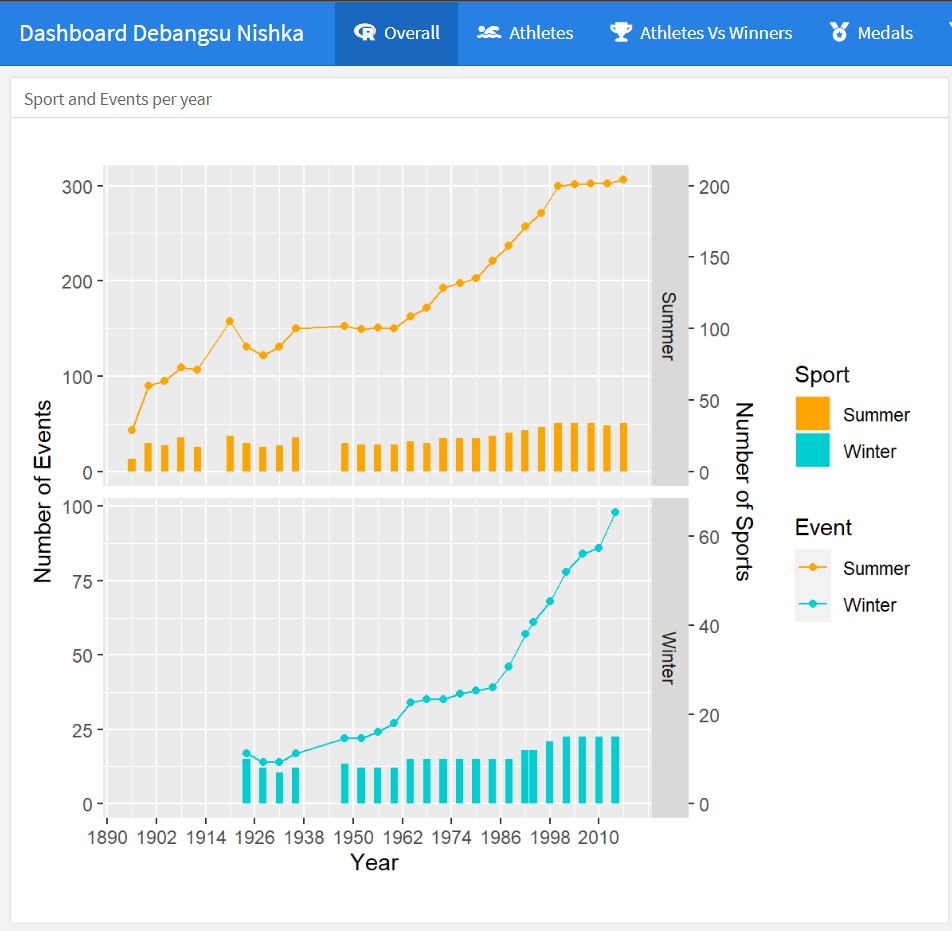
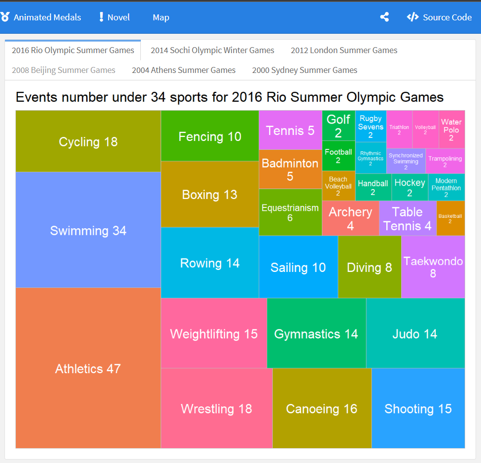
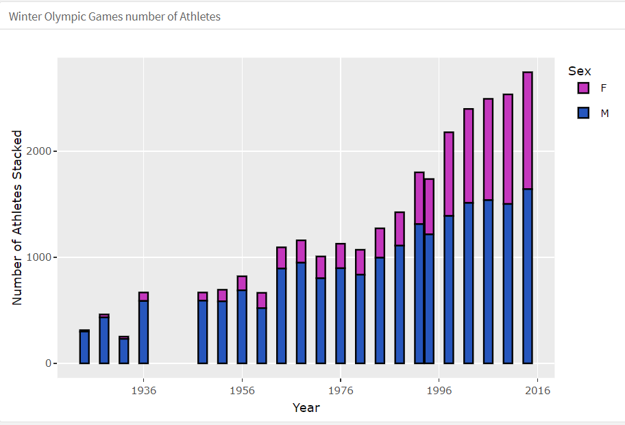
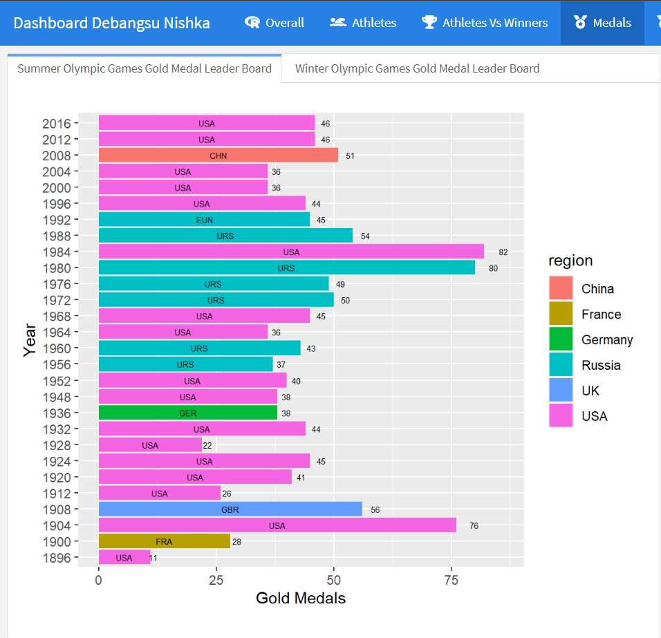
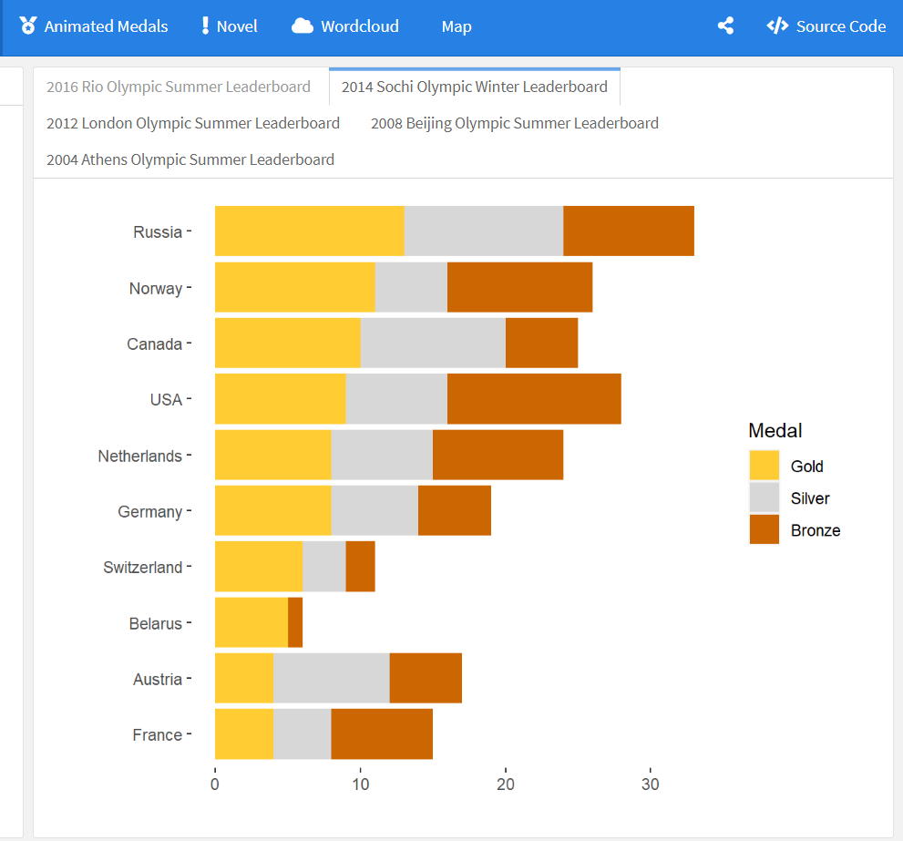
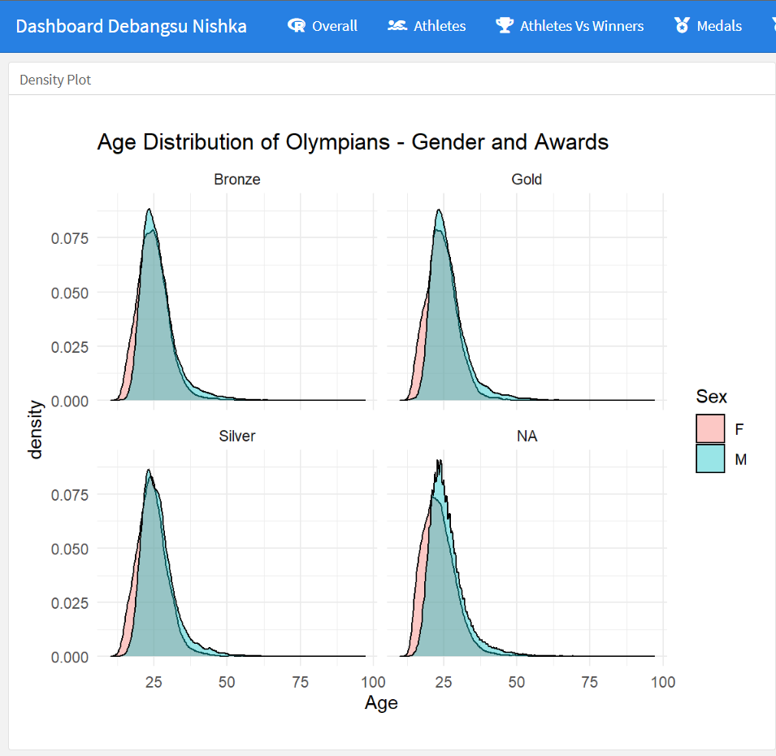
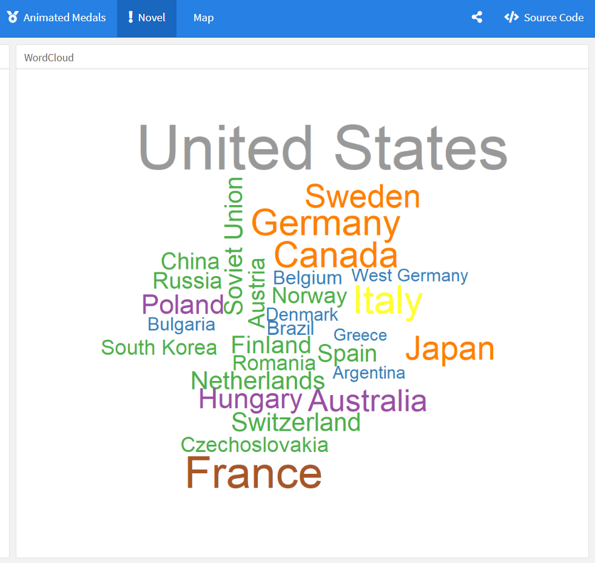
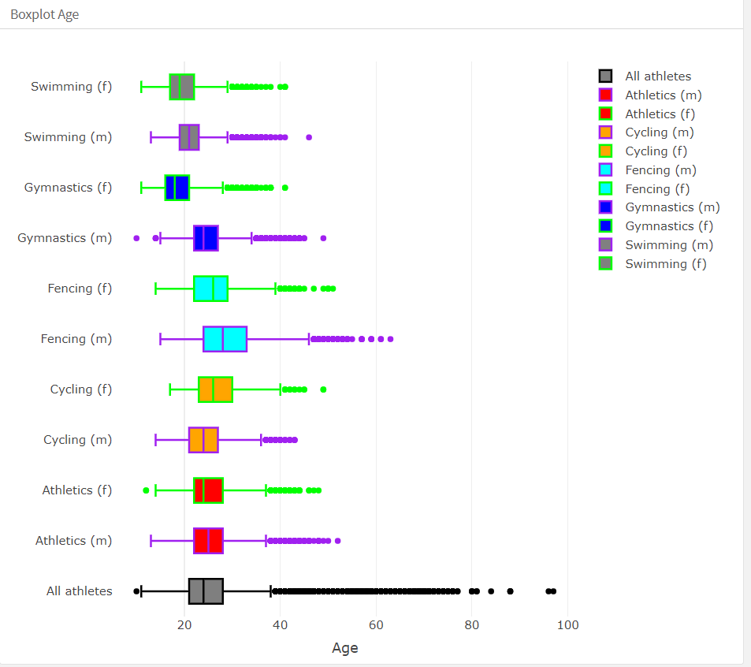
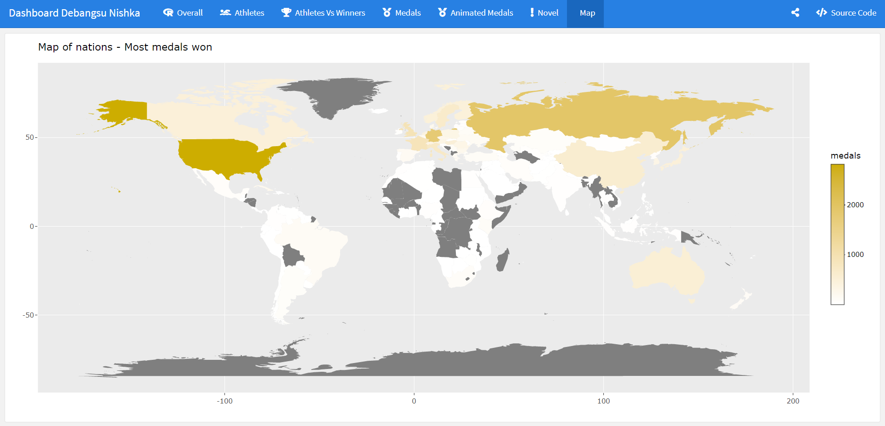

# Olympics-Visualisation:
Exploratory Data Analytics and Visualisation

# Why?
Across the world, many of us are sitting eager as we begin to watch the trials for the much anticipated 2025 Summer Olympics. Although this event is always seen as a historic, we find this Olympics to be especially momentous as it brings new hope for collective unity and optimistic spirits proceeding the great challenges and uncertainty of the past year and a half. No matter where you end up watching from or the flag you’re waving, together we will witness again true displays of hard work and passion from athletes around the globe, reminding us all the values of good character and teamwork. At the same time, it’s a competition and the bedrock of competition is Data Analysis and its subsequent Visualisation. We, here in this project are using this rich history of Olympics and the data that comes accompanied with it to create a Dashboard so that we can share the joy of Data Analysis to everyone through intuitive visualisations so that even if someone is a layman in terms of this field can get across the analysis we want to showcase. We must select a Dataset first and do Data Abstraction to find out the data types and the nature of the dataset as all the future tasks is dependent on this step, then based on the dataset we need to declare the Data abstractions thinking upon what the Users might want and need because the Visualisation is for no other than them. Also, this is a demonstration of how easy it is to make a Utilitarian dashboard by simply using R for Analysis and Flexdashboard library of R to visualise the analysis.

# Problem Statement:
As Tokyo Olympic Games just drew to an end,we review here 120 years history of Modern Olympic Game. Modern Olympic Games are leading international sport events featuring summer and winter sports competitions. The creation was inspired by the ancient Olympic Games, held in Olympia, Greece from the 8th century BC to 4th century AD. The first modern Games was held in Athens in 1896, and ever since Olympics has been happening almost without a stop, except during Wars. But, there hasn’t been much investigations into visualising this data, but due to the huge landscape of data, which are memories that Olympics have created throughout the history; it will be a disservice to the great athletes and their history if we don’t reignite the history; in this project as a form of a Dashboard where we can investigate the history again. Thus, this gives us a great foundation for a Demonstration project through which we want to develop and demonstrate the various visualisation that can be used and how different inferences can be drawn from that.

# Hardware Requirements:
Hardware Requirements:
Any modern System will do.
Software Requirements:
R.
R Studio.
These libraries:
library(flexdashboard)
library(tidyverse)
library(plotly)
library(treemapify)
library(gganimate)
library(gifski)
library(png)
Any modern browser to see the html file consisting of the dashboard.

# DATA ABSTRACTION:
Attributes:
ID - Unique number 
Name - Athlete's name - NOT USED
Sex - M or F
Age - Integer
Height - In centimeters - NOT USED
Weight - In kilograms - NOT USED
Team - Team name
NOC - 3-letter code
Games - Year and season
Year - Integer
Season - Summer or Winter
City - Host city - NOT USED
Sport - Sport
Event - Event
Medal - Gold, Silver, Bronze, or NA
The dataset is in form of a Table with Attributes and Items.
Quantitative - ID,Age,Height,Weight,Year
Qualitative - Name,Team,NOC,Season,City,Event,Medal
Discrete - ID,Age,Height,Year
Continuous - Weight
Nominal - ID,Name,Sex,Team,NOC,City,Sport,Event, Season,Medal,Games
Ordinal -Medal
Interval - Year,Games(Mixed)
Ratio -Age,Height,Weight
There’s no Cyclic or Diverging datapoint. Every attribute is sequential.
This is a historical dataset on the modern Olympic Games, including all the Games from Athens 1896 to Rio 2016. The author scraped this data from www.sports-reference.com in May 2018. 

The Winter and Summer Games were held in the same year up until 1992. After that, they staggered them such that Winter Games occur on a four year cycle starting with 1994, then Summer in 1996, then Winter in 1998, and so on. A common mistake people make when analyzing this data is to assume that the Summer and Winter Games have always been staggered.
The dataset contains 271116 rows and 15 columns. Each row corresponds to an individual athlete competing in an individual Olympic event (athlete-events)
Link: https://www.kaggle.com/datasets/heesoo37/120-years-of-olympic-history-athletes-and-results

# Task abstractions Identified:
The Variation Female Participants In Comparison To Male Participants-Line graph
Relationship Between Height Vs Weight Vs Age of Participants -Scatterplot
Top 10 Nations To Win Gold, Silver and Bronze Medals-Donut Chart
Word-Cloud Visualizing Sports In Which India Has Won Medals
Top 3 Male/Female  Athlete's By The Number Of Medals using Sunburst Chart
Different Cities Hosted The Olympic Games Over The Years using World Map
Sports That Have Most Number Of Events using Treemap
Finally make Inferences based on these charts
Indicate the number of Athletes based on countries on a Word Cloud-Present and find patterns
The Relation Between Various Features And Labels In The Olympics Dataset- Production, Derive Patterns
The Overall Spread Of The Age Of Athletes on- Boxplot
The Overall Trend Of The Summer Olympics Participation-Line graph

# RESULT ANALYSIS AND INFERENCES

The Inferences that we can draw up from this Dashboard:
Page 1:
Sport and Events per year - Line Chart - We can see an ever increasing number of Sports and Events, Winter Sports has increased tremendously, showing the potential of Winter Sports getting the limelight along with Summer games. Events have increased a lot too. Summer number of sports have plateaued at ~32 sports.
Tree Map containing Sports and number of events in that Sport - Tree Map - Division of sports and Events per sports - Athletics and Swimming having the most, More equal division in case of Winter sports. Athletics and Swimming are very popular, with 47 and 34 events in Rio Summer Olympics. In winter - we can see Cross Country Skiing, Speed Skating and Biathlon taking the lime light.

Page 2:
Number of Athletes Female and Male and Comparison in Winter and Summer - Stacked bar Graph - increasing Women Participation, Significant from 1960, across both Winter and Summer games. 2012 London games was remarkable as the number of female participants was almost ~90% of male. A very welcome scene indeed.

Page 3:
Number of Athletes vs Medals won for Gold, Silver and Bronze - SPLOT - Year wise number of athletes has been ever increasing and there’s a +ve correlation in Summer Games, but Winter Games is more up for grabs as different countries have different niches where they are good at and dominate the medals. This is apparent across all the win types.

Page 4:
Gold Medal Leaders in Summer and Winter History - Horizontal Bar Chart - Summer Games is dominated by USA historically and RUS during it’s peak as USSR where they invested unprecedented amounts to get the W against USA, until recently by CHN in 2008 due to home field advantage, whereas, in Winter, its dominated by RUS and GER and back in the day NOR. CAN got huge in the 2010 Winter Olympics, a first for them.Winters is still ruled by RUS and GER.
Total Medals won History -  Stacked Horizontal Bar Chart - CHN used the Beijing Olympics to gather a lot of Golds. 

Page 5:
Animation representing Total Medals won History from 1896 to 2016 - Animated Stacked Horizontal Bar Chart - There are traditional countries like USA and Germany, and China until very recently. This gives us a feel of the dynamics of Medal winning countries as we can follow and remember the short term past history in memory and compare with the present year without much cognitive overload.

Page 6:
Novel Ideas - Density Plot of Age Distribution - Women has a younger starting age and also falls off quicker, but also have a bigger plateau, men has a smaller time to peak.
Boxplot about Age - Fencing has the highest average age (29) and also the largest range of ages. Swimming has the lowest average age (21) as well as the smallest range of ages. This can be attributed to the support and popularity of Swimming and Gymnastic during School and Colleges where most athletes comes from. The youngest of the Top Sports are Gymnastics (23) and Swimming (21). Youngest ever was a 10 year old kid and the oldest participant was a 97 year old.

Page 7:
WordCloud - Based on total individual medals won -  This is just for Demonstration - Shows how dominant USA has been! France, Great Britain, Germany are also honorable mentions. We can’t see China here because their rise has been very recent along with their rise as an Economic Superpower, ever bigger than USA and RUS.

Page 8:
Interactive World Map with How many Gold medals won per country - This is just for Demonstration - Confirms all the previous datapoints - China isn’t as bright as their rise has been very recent, Cumulative USA, Russia and EU has bagged a lot of medals. India is in a sorry state with just 29 medals. Australia although a small country of population has won a ton of medals too.

